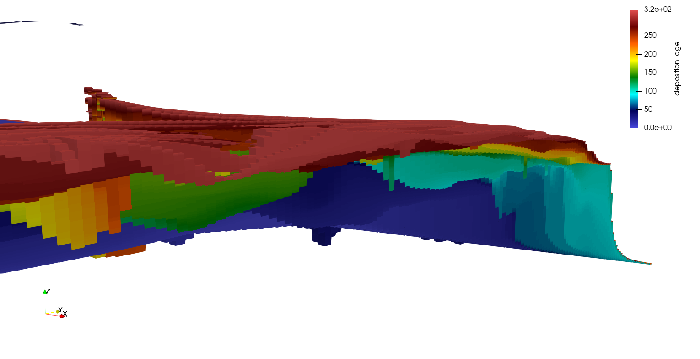

D3D-GeoTool Documentation
=========================

Welcome to the documentation of the Delft3D Geotool package. This Python package handles 
all the preprocessin and postprocessing that is behind the web-based D3D geotool. 
The package can also be used locally.

The technical documentation provides information on the methodology used for both 
preprocessing (D3D model building) and postprocessing steps (D3D model interpretation).

The user guide provides guidance for using the d3d-geotool package locally from 
installation to model creation and postprocessing.

Technical documentation
-----------------------

.. toctree::
   :maxdepth: 4

   technical_docs/introduction_td

User guide (local use)
----------------------

.. toctree::
   :maxdepth: 4

   user_guide/introduction_ug

