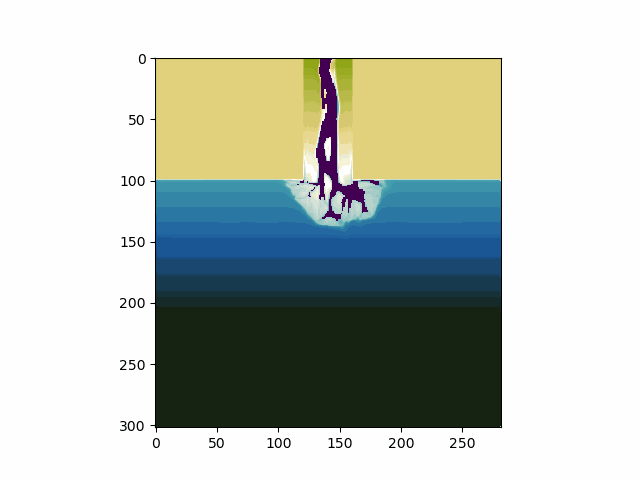
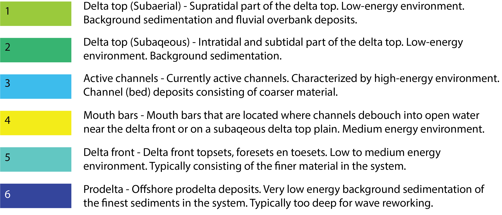
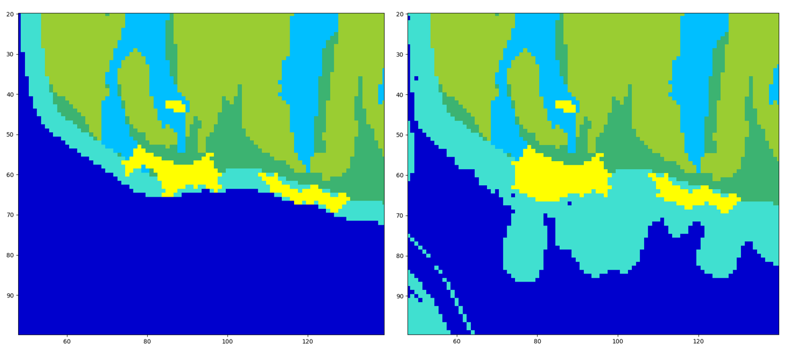

.. _preprocessing:

1 - Preprocessing
#################

Preprocessing in d3d-geotool is the process of creating and adjusting all the required 
Delft3D input files for running a model. It requires 'templates' with basic D3D input 
files as a basis. These templates dictate some parameters that require expert knowlegde, 
the choice of equations that govern the hydronamic and morphological processes and 
the overall bathymetric layout. Preprocessing consists of the following steps:

1. Creating the 'input.ini' file with user-adjustable parameters and the chosen template
2. Running the preprocessing code based on the input.ini file. This process entails:
   
 * Copying the default template files to the the folder where you want to run your model from.
 * Parsing user-defined parameters from the input.ini and removing any obsolete files (e.g. files associated with other sediment compositions).
 * Generating bathymetries (a.dep and wave.dep) based on user-given 'basin slope'.
 * Generating the subsidence (.sdu) file based on user-given subsidence rates.
 * Replacing parameters in various input files by values given in the input.ini file.
  
Upon finishing this process, the newly created Delft3D input folder is ready for use.

.. _templates_for_model_building:

1.1 - Templates for model building
**********************************
Currently there are four templates to choose from:

| **River Dominated delta**
| *Template for a generic river-dominated delta system. Has a straight coastline and a 
  v-shaped initial river valley that is 100 cells (5 km) long. Uses Engelund-Hansen  
  sediment transport equation.*

| **GuleHorn_Neslen**
| *Template for Gule Horn and Neslen formations and comparable deltaic systems. Has a 
  straight coastline and a simple initial river valley that is 100 cells (5 km) long. 
  The fluvial input location shifts overtime to enforce meandering in the fluvial 
  domain. Uses Engelund-Hansen sediment transport equation.*

.. figure:: ../images/River_dominated_delta_GuleHorn_Neslen.jpg
  :width: 600

  Illustration of river dominated and GuleHorn_Neslen templates

| **Roda**
| *Template for the Roda formation and comparable deltaic systems. Has a straight, but
  funnel-shaped coastline and a simple initial river valley that is 100 cells (5 km) 
  long. Uses Van Rijn sediment transport equation.*

.. figure:: ../images/Roda.jpg
  :width: 600

  Illustration of the Roda template

| **Sobrarbe**
| *Template for the Sobrarbe formation and comparable deltaic systems. Has a straight, 
  and short 20 cell (1 km) river valley. The river valley has four inflow points
  for channels that are separated by cone-shaped non-erodable obstacles. Simulates a
  wide braided floodplain entering a sedimentary basin. Uses Van Rijn sediment 
  transport equation.*

  Illustration of the Sobrarbe template

.. _the_input.ini_file:

1.2 - The input.ini file
************************
The input.ini file is where you can edit all user-adjustable model parameters. The
preprocessing script needs this file as input alongside a folder location to write the
Delft3D input files to. Below is a description of editable parameters

.. csv-table:: input.ini overview
   :header: Parameter,Description
   :delim: |
   :file: inputini_overview.csv

.. _postprocessing:

2 - Postprocessing
##################
After running a model the postprocessing modules of d3d-geotool can be used to generate
additional data from the completed models. The following results can be generated from a 
completed Delft3D model run:

* Sediment (distribution) properties: d-values, sorting, porosity and permeability.
* Preserved deposits and age of these deposits.
* Subenvironments: Delta top, Delta front and Prodelta
* Channel data: channel network, channel skeleton, channel width, channel depth
* Architectural elements
* Additional statistics per architectural element: volume percentage of total delta volume, D50 distribution, average sorting and average sand fraction.

.. _sediment_properties:

2.1 - Sediment properties
*************************
The following parameters are used to calculate sediment properties:

* D50 per input sediment class (derived from sed-file or calculated, see below)
* Dry bed density per sediment class (derived from sed-file)
* Mass fluxes per sediment class ('DMSEDCUM' in trim.nc file)

.. note:: 

   Sediment classes are defined by the 'composition' parameter in the input.ini

.. _d50_input_data:

2.1.1 - D50 input data
----------------------
D50 per input sediment type is directly taken from the sed-file if the sediment class 
type is sand. In the case of mud, Stokes' law for settling velocity is used to derive 
a D50-value:

.. math:: 
   D_{50} = \sqrt{18 \cdot \mu \cdot \eta / g / (\rho_p - \rho_f)}

where :math:`{\mu}` is the settling velocity, :math:`{\eta}` is dynamic viscosity, 
:math:`{\rho_p}` is the specific density of the material, :math:`{\rho_f}` is the 
density of water and :math:`{g}` is the acceleration due to gravity.

.. _d-values_from_a_cdf:

2.1.2 - D-values from a CDF
---------------------------
At a given time and location, positive mass fluxes per sediment class directly determine 
the composition of sediment preserved during the given output timestep. Combined with 
the dry bed density of each sediment class, the mass distribution of deposited sediment 
is first converted to volume fractions. Sediment volume fraction data is then used to 
compute a cumulative sediment distribution function (CDF), from which other parameters 
such as median grain size (D50), porosity and permeability will be derived. 

The calculation of the CDF can best be described by an example: A ‘coarse-sand’ D3D-GT 
model has the following proportions of six sediment classes, with associated median 
grain size for that class, at a single location in the model output:

.. csv-table:: 
   :header: Sediment class,Grain size :math:`{\phi}` (:math:`{\mu}`m),Example volume fractions
   :delim: |
   :file: example_vfractions.csv

These fractions are used to compute the CDF by linear interpolation within a phi-scale 
range of [coarsest – 0.5] to [finest + 0.5]. Hence for the above example, the 
distribution is calculated between -0.5 and 4.84, corresponding to grain sizes of 1414 
to 36 μm. Since the grain sizes in the above table represent median grain size of the 
sediment class, the interpolation points are inbetween sediment classes. Thus, 
the following points are used for interpolation of the given example:

.. csv-table:: 
   :header: Grain size :math:`{\phi}`,Quantile
   :delim: |
   :file: example_interpolation_pts.csv

Linear interpolation between these points result in the CDF shown in the Figure below.
The D50 of the sediment mixture within that cell then follows from the CDF, as it 
corresponds to the 0.5 quantile. In the example case the corresponding median grain size 
is 1.6 on the phi-scale, which translates to 330 μm. Other d-values can be obtained from
this interpolated CDF.

  Example of linear interpolation between sediment class mass fraction values to produce 
  a cumulative distribution function at each location in the simulated sediment body. 
  Note that due to use of the phi scale the coarsest grain sizes occur on the left and 
  the finest on the right of the graph.

.. _porosity:

2.1.3 - Porosity
----------------
Porosity of the unconsolidated sediments was calculated using the empirical fit by 
Takebayashi & Fijita (2014). Their equation is based on the grain size standard 
deviation of a sediment sample, the logic behind this being that a high standard 
deviation means more grains of different sizes that effectively fill each other’s pore 
spaces, reducing porosity. The empirical equation is given by:

.. math:: 
   \varphi = C_1 \cdot \frac{C_2\sigma^{C_3}}{1 + C_2\sigma^{C_3'}}

with constants :math:`{C_1}` = 0.38; :math:`{C_2}` = 3.7632; and :math:`{C_3}` = -0.7552. 
In our case :math:`{\sigma}` is the standard deviation of a synthetic sediment sample. 
This is a possible collection of grains that is derived from the CDF, that, unlike the 
CDF, allows for the computation of n-th order moments of the distribution. This is 
essentially a fitted sediment sample, which retains the simplicity and limitations of 
the input data consisting of six discrete grain size classes. E.g. a sample could then 
be defined as 20 x grainsize 1, 40 x grainsize 2, 1 x grainsize 3 etc, derived from the 
fractions of each sediment class in a cell.

.. _permeability:

2.1.4 - Permeability
--------------------
Permeability was calculated using the empirical relation by Panda & Lake (1994) given by:

.. math:: 
   k = \frac{D_p^2\varphi^3}{72\tau(1-\varphi)^2} \left [\frac{(\gamma C_{D_p}^3 + 3C_{D_p}^2 + 1)^2}{(1 + C_{D_p}^2)^2}  \right ]

where :math:`{k}` = permeability in m2, :math:`{D_p}` = the weighted mean grain size in 
m, :math:`{\varphi}` = porosity, :math:`{\tau}` = tortuosity, :math:`{C_{D_p}}` = Coefficient 
of variation, and :math:`{\gamma}` = skewness of sediment distribution. 

Here permeability is assumed to be a direct function of porosity and, in addition, 
indirectly also related to porosity through tortuosity. Tortuosity is the ratio between 
the length of a flow path between two points (say A and B) and the shortest distance 
between these points. If the porosity is high, the flow path from point A to B is more 
likely to be direct, with less twisting and bending to pass between grains. The 
tortuosity consequently approaches 1 for a straight flow path. With less winding and 
obstructed flow pathways between grains, permeability becomes higher and is therefore 
inversely related to tortuosity. In other words: a lower tortuosity (closer to 1) leads 
to higher permeability. Tortuosity was computed using the analytical model of Ahmadi et 
al. (2011), which is given as a function of porosity by:

.. math:: 
   \tau = \sqrt{\frac{2\varphi}{3[1-1.209(1-\varphi)^{2/3}]} + \frac{1}{3}}

Permeability in furthermore depends on the skewness (bias) of the 
distribution. E.g., a positive skewness, which means that there is a bias towards 
smaller grains, leads to a lower permeability. Finally, a higher coefficient of 
variation also leads to a lower permeability, following the logic that a heterogenous 
sample of grains fills pore spaces more effectively compared to a homogenous one.

No assumptions are made regarding post-depositional diagenesis of the deposits, as this 
is not data that can be obtained from the Delft3D simulation output. Permeability values 
are thus much larger that is observed in field measurements of subsurface deposits.

.. _preservation_and_deposition_age:

2.2 - Preservation and deposition age
*************************************
Preservation data is derived along with the age of deposition, which is used to
reconstruct the stratigraphy. At any location and output timestep (t, x, y) sediment
is deposited when the total incoming amount of sediment exceeds the amount of outgoing
sediment (i.e. a negative sediment flux). The bed level increases by an amount that is 
calculated from the total deposited volume and the cell size. If the flux is positive, 
so if more sediment leaves the cell than what comes in, there is erosion taking place 
and the bed level is lowered. In addition, the entire stack of already accumulated 
sediment is lowered by the amount of subsidence that is applied to that location. 

The data variable *preserved_thickness* indicates how much of a deposited layer will 
make it to the final timestep of the model and can thus be considered to be 'preserved' 
in the final stratigraphic sequence. Suppose we have a deposit of 0.4 m thick at timestep 
:math:`t_{current}`. Let's consider the following values of *preserved_thickness* and
explain what they mean:

* 0   : *The entire 0.4 m will be completely eroded by the end of the model run* 
* 0.4 : *All of the sediment deposited will make it to the end and is preserved*
* 0.1 : *0.3 m of our initial deposit will be eroded, but 0.1 m will be preserved*

For every t, x and y, the age of deposition will be recorded in the *deposition_age* 
data variable. Both *preservation_thickness* an *deposition_age* are part of the 
postprocessing export, see Chapter 3.

  Example of deposition age visualized in a cross section. You can also see how the
  position of (until then) preserved layers are lowered due to subsidence. 

.. _subenvironment_classification:

2.3 - Subenvironment classification
***********************************
The subenvironment is a broad division between delta top, delta front and prodelta
environments. This division is based on finding the 'edge' of the delta and using this 
edge along with an expected width of the delta front to divide the grid into
subenvironments. The algorithm works as follows:

1. Compute slope maps
2. For every 5 timesteps: find the depth contour between 2.5 and 8 m that samples to the 
   highest slope on average. This depth contour follows the steepest part of the delta
   front foresets.
3. Fit a second-order polynomial function through the depths found in step 2. See Figure
   below.
4. This function f(timestep) is used to determine the foreset depth for every timestep.
5. The depth contour at depth f(timestep) is buffered on both sides by half the expected
   width of the delta front.
6. The area inbetween the buffer lines is delta front, seaward of the outer buffer line 
   is prodelta and landward of the inner buffer line the subenvironment is delta top.

.. note::

   Because of the way the foreset location is determined, it is advised to run the
   postprocessing only on models with at least 100 completed output timesteps.

.. note::

   Currently, the expected width of the delta front is given in the postprocessing
   settings per template (see 2.6 below) and is a fixed value. In the future, this
   expected width will be automatically determined like the foreset depth to ensure 
   better subenvironment classification with non-default model settings.

.. figure:: ../images/steepest_df.png
  :width: 600

  The steepest part of the delta front foresets lies progressively deeper as the delta
  expands into deeper parts of the basin. This is an example with a seaward-increasing 
  subsidence rate, enhancing this effect even further.

.. _channel_classification:

2.4 - Channel classification
****************************
There are two methods available for classifying the channel network:

* Static: *classifies channels based on static depth and flow velocity conditions*
* Local: *classifies channels based on local differences in water depth and flow velocity*

By default, the static method is used in the River dominated and Gule Horn / Neslen
templates, whereas the local method was specifically designed to work better for the 
Roda and Sobrarbe templates. As a general guideline to choose between the two methods:

* Choose the static channel classification method if the delta:
   - Has a strongly braided channel network (see animation below)
   - Has a pronounced subaerial delta top (less subaqeous channels)
* Choose the local channel classification method if the delta:
   - Features less, but wider channels that continue in the subaqeous part of the delta
   - Has a pronounced subaqeous delta top

.. note::

   In the future we aim to improve channel classification by using a single generic 
   method that doesn't require fine-tuning by the user.

.. _static_method:

2.4.1 - Static method
---------------------
The static channel network classification method uses only the channel classification 
sensitivity to determine depth and flow velocity threshold values (see: :ref:`Postprocessing settings <postprocessing_settings>`).
The method is based on evaluating two D3D model output variables:

* :math:`{U_{max}}`: the maximum flow velocity recorded during an output timestep
* :math:`{D}`: the average water depth during the output timestep

The following threshold values are defined:

* :math:`{U_{max, req}}` = 3 * (1 - sensitivity)
* :math:`{U_{max, minreq}}` = 1.2 * (1 - sensitivity)
* :math:`{D_{req}}` = 2.5 * (1 - sensitivity)

The condition to classify a cell as a channel based on these threshold values is:

.. math:: 
   [(U_{max} > U_{max,req}) OR (Depth > D_{req})] AND (U_{max} > U_{max,minreq})
   
For example, if the detection sensitivity is set to 0.5, a cell with a :math:`{U_{max}}`
of 0.7 m/s and a depth :math:`D` of 1.5 m would classify as a channel because...

.. math:: 
   [(0.6 > 1.5) OR (2 > 1.25)] AND (0.7 > 0.6)

...is TRUE. If the sensitivity was set to 0.3 for instance, the conditions would return 
FALSE because :math:`{U_{max,minreq}}` would be 0.84, whereas :math:`{U_{max}}`
in our example is 0.7.

  Example of channel detection (sensitivity = 0.55) in a Gule Horn / Neslen model run. 

.. _local_method:

2.4.2 - Local method
--------------------
The local method considers the difference between :math:`{U_{max}}` and :math:`D` and 
the lowest values found for these parameters within a user-determined search radius.
(see: :ref:`Postprocessing settings <postprocessing_settings>`). 
The condition that is checked to determine whether a cell is part of a channel or not is:

.. math:: 
   [D_{\delta_{local}} < (-1 + sensitivity)] AND [U_{max_{\delta_{local}}} < (-1 + sensitivity)]

For example, suppose the depth is 5 m and the shallowest depth within search radius
distance is 4 m. This means that :math:`D_{\delta_{local}}` = -1. :math:`{U_{max}}` = 0.7
m/s whereas the lowest :math:`{U_{max}}` within search radius distance is 0.3 m/s. So 
:math:`U_{max_{\delta_{local}}}` = -0.4. With a channel detection sensitivity of 0.65
both conditions are fulfilled because...

.. math:: 
   [-1 < (-1 + 0.65)] AND [-0.4 < (-1 + 0.65)]

...is TRUE and hence the cell is determined to be part of a channel. Had the sensitivity
been lower at 0.5, the flow velocity condition would be FALSE and the cell would not be
classified as part of a channel.

  Example of channel detection (sensitivity = 0.65) in a Gule Horn / Neslen model run. 

.. _additional_channel_data:

2.4.3 - Additional channel data
-------------------------------
Apart from a boolean raster that indicates whether a cell is part of a channel or not, 
cells that are classified as channel are used to derive additional channel data:

* Channel skeleton: *binary 1-pixel wide representation of channel network*
* Channel width: *Maximum width of the channel at this location*
* Channel depth: *Depth of the channel at this location* 

.. note::

   The additional channel parameters are currently not exported in the output netCDF
   file, but can be accessed from an instance of the gtpost.model.ModelResult class
   after running the channel classification process.

.. _architectural_element_detection:

2.5 - Architectural element detection
*************************************
The main feature of post-processing is the detection of architectural elements. The
following architectural elements are available:

The actual detection is based on flow and sediment parameters as well as the previously
determined subenvironments. The following sections dive deeper into the detection of 
each of the architectural elements.

.. _prodelta_delta_front_and_delta_top:

2.5.1 - Prodelta, Delta front and Delta top
-------------------------------------------
The prodelta, delta front and delta top architectural elements are the easiest to
classify as they are directly related to the already determined subenvironments. The
only adjustment with respect to the subenvironments is the extent of the delta front. The
delta front may be expanded into the prodelta subenvironment based on the sand fraction. 
If the sand fraction is higher than the threshold value *deltafront_detection_minimal_sandfraction*
(see :ref:`Postprocessing settings <postprocessing_settings>` below). 

The subenvironment delta top is divided into a subaerial and subaqeous part based on the 
setting *delta_top_subaqeous_depth*. Shallow parts of the delta top subenvironment will
be designated as subaerial delta top, while deeper parts become subaqeous delta top.

  Comparison between the extent of the delta front when not considering the additional
  condition for sand fraction (left) versus extending the delta front area by areas  
  with deposits that have a sand fraction above 0.2 (right). Example is from a Sobrarbe 
  model result.

.. _mouth_bars_and_active_channels:

2.5.2 - Mouth bars and active channels
--------------------------------------
Active channels are subsequently assigned to the architectural element grid and are
directly based on the channel classification result. They may only exist where the
subenvironment is classified as delta top. 

| The classification of mouth bars is more advanced and consists of two main steps:
1. Designating the area where mouth bars may exist 
2. Classify mouth bars within these areas based on bed level change conditions

Mouth bars are expected in the area where channels debouch into open water. Hence the 
'tips' or 'end points' of classified channels must first be determined. An algorithm is
applied to find these end points based on the channel skeleton (see :ref:`Ch. 2.4.3 <additional_channel_data>`).

.. figure:: ../images/channel_endpoints.png
  :width: 600

  Example of detected endpoints in a channel network

The areas where mouth bars may exists are then determined as follows:

* Determine the circular areas around the channel end points based on the *mouthbar_detection_search_radius*
* Apply the following additional conditions to further filter these areas:   
   - Cells may not be part of 'subaerial delta top'
   - Cells may not be part of 'prodelta'
   - Water depth in cells may not be greater than 2/3 of the 'foreset depth' (:ref:`Ch. 2.3 <subenvironment_classification>`) 

This yields the areas where mouth bars can be expected. In step 2, the following 
conditions for bed level change are applied to determine whether a cell is part of a 
mouth bar or not.

.. math:: 
   \begin{align*}MB_{allowed}\ AND\ [Archel\ is\ 'Delta front']\ AND\ [\delta D\ >\ MB_{df}]\end{align*}

.. math:: 
   OR

.. math:: 
   \begin{align*}MB_{allowed}\ AND\ [Archel\ is\ 'Subaqeous\ delta\ top']\ AND\ [\delta D\ >\ MB_{dt}]\end{align*}

.. math:: 
   OR

.. math:: 
   \begin{align*}MB_{allowed}\ AND\ [Archel\ is\ 'Active\ channel']\ AND\ [\delta D\ >\ MB_{ch}]\end{align*}

where :math:`MB_{allowed}` is the area where mouth bars may be expected as determined in step 1, :math:`\delta D`
is bed level change, and :math:`MB_{df}`, :math:`MB_{dt}` and :math:`MB_{ch}` are the 
threshold values for bed level change that correspond to the settings
*mouthbar_detection_critical_bl_change_df*, *mouthbar_detection_critical_bl_change_dt*
and *mouthbar_detection_critical_bl_change_ch* respectively.

.. _postprocessing_settings:

2.6 - Postprocessing settings
*****************************
There are several settings that govern aspects of the postprocessing such as channel 
classification and architectural element detection. Below is an overview of available 
settings:

.. note::

   You can find the settings .ini files in the config folder that comes with the Python
   package. They are specified for each template and must share the same name as these
   templates.

.. csv-table:: 
   :header: Setting name,Description
   :delim: |
   :file: postprocess_settings.csv

.. _changes_introduced_for_roda/sobrarbe:

2.7 - Changes introduced for Roda/Sobrarbe
******************************************
A number of changes in the postprocessing were specifically introduced to better support
the Roda and Sobrarbe model templates and improve the overall quality of the
postprocessing results. In general, the entire codebase was rewritten in Python 3.11.

2.7.1 - Delta edge area
-----------------------
| **Previous approach**
| The 'delta fringe' would be determined by taking the fixed 3 m depth contour. The
| delta edge area was determined by placing a line some distance radially inward towards
| the delta apex.

| **Reason to adjust**
| Especially in the Roda model, the topset of the delta front we expect to lie at depths 
| of up to 6 m. The 3 m depth contour would end up somewhere on the subaqeous delta top
| in this case and would not represent the edge of the delta.

| **Improved approach**
| Dynamic assignment of the 'foreset depth' through time based on finding the depth 
| contour that has the steepest average slope and thus represents the steepest part of 
| the delta front foresets. See :ref:`Ch. 2.3 <subenvironment_classification>`.

2.7.2 - Channel classification
------------------------------
| **Previous approach**
| Only the static channel classification method was available.

| **Reason to adjust**
| Static channel classification is based on absolute depth, which doesn't work well for
| subaqeous channels. 

| **Improved approach**
| The local method was added that keeps working in subaqeous parts of the delta because 
| it considers local variations rather than absolute values.

2.7.3 - Abandoned channels
--------------------------
| **Previous approach**
| Abandoned channels were identified.

| **Reason to adjust**
| The classification of abandoned channels was often unreliable.

| **Improved approach**
| We opted to remove abandoned channels from the architectural element classification.

2.7.4 - Delta top variants
--------------------------
| **Previous approach**
| Only 'Delta top' as architectural element was identified.

| **Reason to adjust**
| A distiction between subaerial and (sometimes) submerged delta top is useful as the
| depositional environments are subject to different forcings and show different 
| sediment and sorting characteristics.

| **Improved approach**
| A division between subaerial and subaqeous delta top was added.

2.7.5 - Mouth bar detection
---------------------------
| **Previous approach**
| Consideration of channels in the vicinity was simple and mouthbars could only exist
| if the subenvironment was 'delta front'.

| **Reason to adjust**
| With more extensive subaqeous delta top plains (Roda) and wide channel mouths 
| (Sobrarbe) we had to be able to identify mouthbars within these units as well.

| **Improved approach**
| The channel end point method to determine mouth bar allowable areas in combinations
| with threshold values for detecting mouthbars on top of existing architectural
| elements is now applied. See :ref:`Ch. 2.5.2 <mouth_bars_and_active_channels>`. 

.. _data_export:

3 - Data export
###############
All (postprocessing) data can be exported to a single netCDF file or a specified 
timestep can be exported to a VTK file for 3D viewing in third-party software.

.. _sediment_and_object_data_netcdf:

3.1 - Sediment and object data netCDF
*************************************
The main export of postprocessing data is a netCDF file. The following parameters are
exported:

.. csv-table:: 
   :header: Parameter,Description,Dimensions,Units,Remarks
   :delim: |
   :file: exported_parameters.csv

.. _statistics_summary:

3.2 - Statistics summary
************************
Statistics can be generated and exported to e.g. a JSON file. The following statistics
for the delta part of the model are generated when running postprocessing:

* Delta volume: Total volume of the delta in cubic meters
* For each architectural element:
   - Volume in cubic meters
   - Average D50 grain size
   - Average sand fraction
   - Average sorting score

.. note::

   In the Geotool, these statistics will be displayed in the GUI after postprocessing.

.. figure:: ../images/archel_summary.png
  :width: 600

  Example of D50 per architectural element statistics